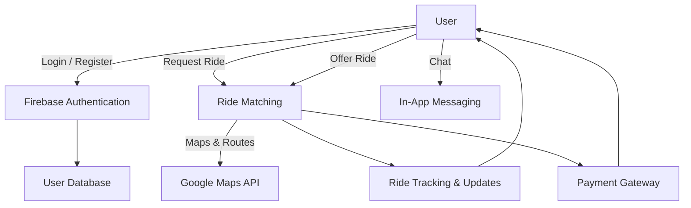

# 🚗 Lift Share App

Lift Share is an **Android-based ride-sharing application** designed to make short-distance commuting more **affordable, secure, and eco-friendly**.

It connects individuals who want to **offer or request rides** within the city, focusing on cost-effectiveness and sustainability, unlike traditional ride-hailing services.

---

## 📌 Features

- 🔐 **Secure Authentication**
    - Aadhaar-based identity verification for all users.
    - RTO vehicle license verification for drivers.
- 🗺️ **Real-Time Ride Services**
    - Google Maps API integration for reliable mapping.
    - Live ride tracking & route optimization.
- 💬 **In-App Communication**
    - Secure chat system between riders and drivers.
- 💳 **Seamless Transactions**
    - Integrated payment gateway for cashless, secure rides.
- 🌍 **Sustainability**
    - Reduces fuel consumption and traffic congestion by promoting shared mobility.
    - Fosters eco-friendly commuting habits.

---

## 📱 Tech Stack

| Component | Technology | Description |
| :--- | :--- | :--- |
| **Frontend** | [Flutter](https://flutter.dev/) | Cross-platform framework focused on a native Android experience. |
| **Backend** | [Firebase](https://firebase.google.com/) | Provides real-time database, authentication, and robust cloud services. |
| **Maps & Navigation** | [Google Maps API](https://developers.google.com/maps) | Powers all geographical and routing functionalities. |
| **Authentication** | Aadhaar & RTO Verification APIs | Used for mandatory, secure identity and vehicle verification. |
| **Payment** | Integrated Payment Gateway | Handles all in-app, cashless transactions. |

---

## 🏗️ System Architecture


## 🚀 Installation & Setup

### 1. Clone the repository

```bash
git clone [https://github.com/your-username/lift-share-app.git](https://github.com/your-username/lift-share-app.git)
cd lift-share-app
```
### 2. Install dependencies

```bash
flutter pub get
```
### 3. Configure Firebase

1.  Create a **Firebase project** in the [Firebase Console](https://console.firebase.google.com/).
2.  Add your **Android app** to the project and download the `google-services.json` file.
3.  Place `google-services.json` inside the `android/app/` directory.
4.  Enable the following services in your Firebase project:
    * **Authentication** (Enable Email/Password, Phone, etc.)
    * **Realtime Database** or **Firestore**

### 4. Enable Google Maps API

1.  Enable the **Google Maps Platform SDK for Android** in the [Google Cloud Console](https://console.cloud.google.com/).
2.  Securely configure your API key within the Flutter project (usually in `android/app/src/main/AndroidManifest.xml` or via environment variables).

### 5. Run the app

```bash
flutter run
```
---

## 🚀 Future Enhancements

- 🚦 **Ride scheduling** & carpool group management
- 📉 **Carbon footprint tracking** per user
- 🔔 **Push notifications** for ride updates
- 🌐 **iOS version support**

---

## 🧩 Challenges

- Ensuring **real-time location accuracy**
- Maintaining **user privacy & data protection**
- Encouraging **community adoption & trust**
- Scaling for **metropolitan-level traffic**

---

## 🙌 Contributors

- **Akshat Negi** (B.Tech. CSE - CSF, SAP ID: 500106703)
- **Devansh Rawat** (B.Tech. CSE - G&G, SAP ID: 500106257)
- **Aadeesh Jain** (B.Tech. CSE - CSF, SAP ID: 500106290)

Guided by **Mrs. Richa Kumari** from the School of Computer Science, UPES, Dehradun.

---

## 📖 References

1. Jamal, J., Rizzoli, A.E., Montemanni, R. & Huber, D. (2016). *Tour Planning and Ride Matching for an Urban Social Carpooling Service*.
2. Meiller, D. (2021). *Modern app development with Dart and Flutter 2*. De Gruyter Oldenbourg.
3. Peterson, M.P. (2012). *Online Maps with APIs and WebServices*. Springer.
4. [Firebase Documentation](https://firebase.google.com/docs)
5. Dash, S.K. (2023). *Ultimate Web Authentication Handbook*. Orange Education Pvt Ltd.  
